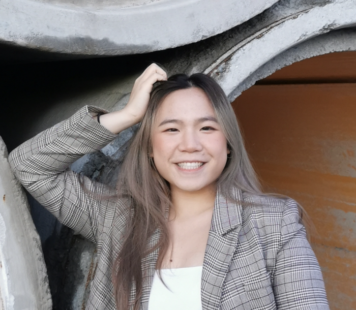

My name is Jennifer Tsang, nice to meet you! I hold a Bachelor's in
Biomedical Engineering and am currently pursuing a Master's in Data
Science at the University of British Columbia. My interests lie in
biostatistics, data-driven healthcare, and bridging the gap between
engineering and data science.

{fig-align="center" width="300"}

[Contact Me](https://www.linkedin.com/in/jennifertsang8919/)

About Me

...

To learn more about Jennifer, click the About tab.

Hobbies

Outside of academics, I enjoy both creative and active pursuits. I love
baking and crocheting, which let me express creativity and attention to
detail. I also stay active through badminton, ultimate frisbee, and
hiking, which keep me energized and connected with friends.

A highlight of my baking journey is being selected as one of the 10
bakers on Season 9 of [The Great Canadian Baking
Show](https://www.cbc.ca/television/the-great-canadian-baking-show/jennifer-tsang-gcbs-baker-bio-1.7624553)!
